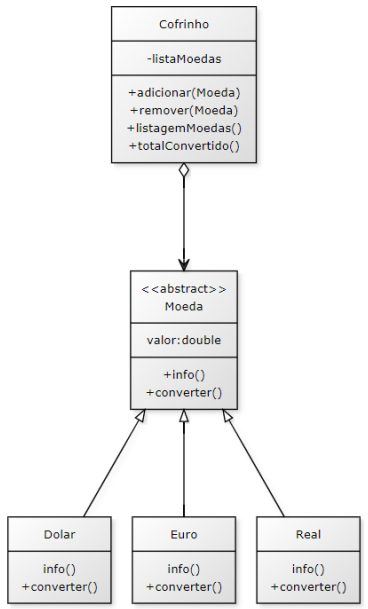

# Trabalho Programação Orientação a Objetos

Esse trabalho foi feito na matéria de POO (Programação Orientada a Objetos), com o intuito de desenvolver as habilidades
práticas aprendidas durante as aulas.

## Requisitos Funcionais da aplicação

"O objetivo principal do trabalho é avaliar o bom uso do conceito de herança e
polimorfismo. O projeto deve possuir uma classe Principal além das classes descritas no
diagrama UML abaixo.
A classe Cofrinho deve possuir como atributo uma coleção de Moedas, que por sua
vez é uma classe mãe abstrata de outras classes específicas de Dolar, Euro, Real, etc... A
coleção de Moedas pode ser implementada utilizando um ArrayList, ou qualquer outra
estrutura de dados que julgue pertinente.
Demais detalhes de implementação ficam a cargo do aluno que pode desenvolver
também classes extras ou adicionar métodos e atributos conforme julgar necessário."

